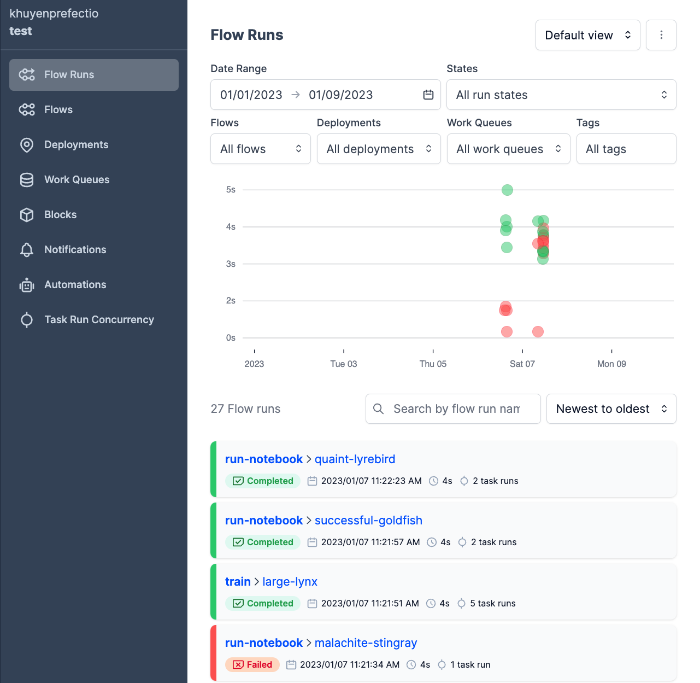
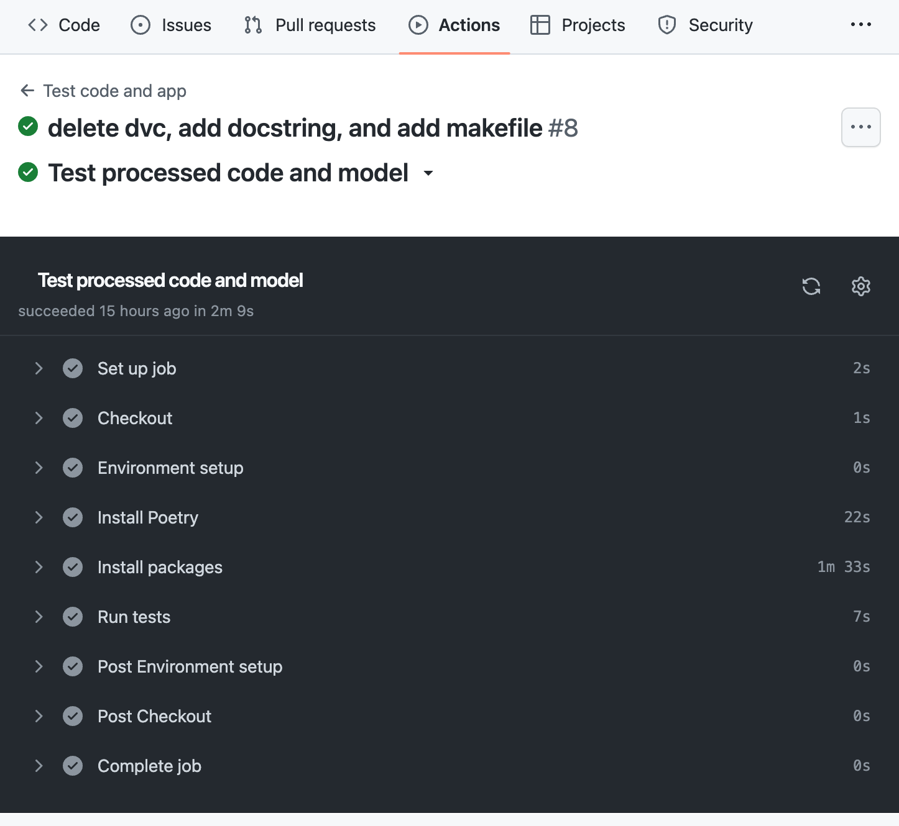

[](https://towardsdatascience.com/how-to-structure-an-ml-project-for-reproducibility-and-maintainability-54d5e53b4c82?sk=c3d05ae5b8ccc95822618d0dacfad8a4)

# Data Science Project

This project aims to propose an application for predicting the outcome of tennis matches based on the ATP data. This kind of application could be used for example in making money on sports betting.


The repository of the project has been initiated using cookiecutter and a project template

```bash
# Install Cookiecutter:
pip install cookiecutter

# Create the project based on the template
cookiecutter https://github.com/khuyentran1401/data-science-template
```


## Quick Start

### Set up the environment

1. Create a virtual environment
2. Set up the environment:

```bash
make setup
make activate
```

### Install new packages

To install new PyPI packages, run:

```bash
pip install <package-name>
```

### Download the raw dataset

Download the raw data from kaggle and put it in the data/raw folder. There are three files, only the *'atp_matches_till_YYYY'* is needed. In this case, we use *'atp_matches_till_2022'*

**Data source:** https://www.kaggle.com/sijovm/atpdata

### Run Python scripts

To run the Python scripts to process the raw data, prepare the processed data for the train and train a model, type the following:

```bash
make pipeline
```

### View all flow runs

A [flow](https://docs.prefect.io/concepts/flows/) is the basis of all Prefect workflows.

To view your flow runs from a UI, sign in to your [Prefect Cloud](https://app.prefect.cloud/) account or spin up a Prefect Orion server on your local machine:

```bash
prefect orion start
```

Open the URL http://127.0.0.1:4200/, and you should see the Prefect UI:



### Run flows from the UI

After [creating a deployment](https://towardsdatascience.com/build-a-full-stack-ml-application-with-pydantic-and-prefect-915f00fe0c62?sk=b1f8c5cb53a6a9d7f48d66fa778e9cf0), you can run a flow from the UI with default parameters:


or custom parameters:


### Auto-generate API documentation

To auto-generate API document for your project, run:

```bash
make docs_save
```

### Run tests when creating a PR

When creating a PR, the tests in your `tests` folder will automatically run.


